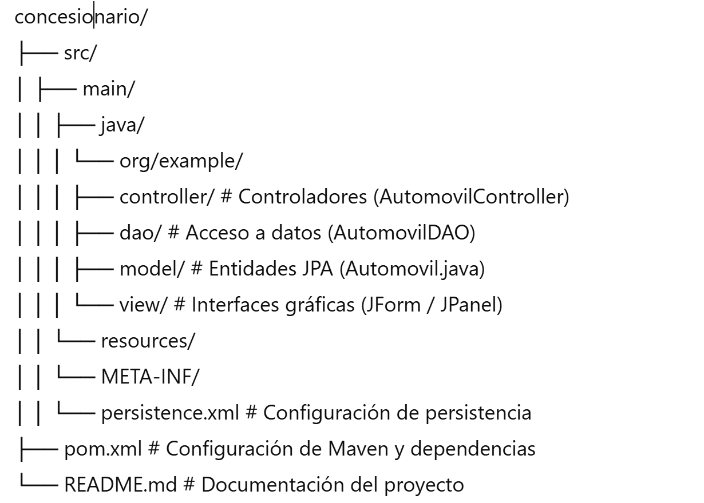

# 🚗 Concesionario Java con JForm (Swing)

**Descripción:**  
Aplicación de escritorio en **Java** que gestiona un concesionario de automóviles. Permite crear, consultar, editar y eliminar vehículos mediante una **interfaz gráfica (JForm / Swing)** y utiliza **Hibernate JPA** para la persistencia de datos en **MySQL**.

---

## 🎯 Características principales

- Interfaz gráfica **intuitiva y sencilla** con JForm (Swing).  
- **CRUD completo** de automóviles:  
  - Alta  
  - Consulta  
  - Edición  
  - Eliminación  
- Persistencia de datos mediante **Hibernate + JPA**.  
- Validaciones básicas para garantizar la integridad de los datos.  
- Compatible con MySQL.

---

## 🛠 Tecnologías utilizadas

| Tecnología | Versión | Descripción |
|------------|--------|-------------|
| Java SE    | 17     | Lenguaje de programación principal |
| Swing / JForm | -   | Interfaz gráfica de usuario |
| Hibernate ORM | 6.6.1.Final | Framework de persistencia |
| JPA (Jakarta Persistence) | 3.1.0 | API de persistencia de Java |
| MySQL | 8+      | Base de datos relacional |
| Maven | 3+      | Gestión de dependencias y compilación |

---

## 📂 Estructura del proyecto





---

## Instalación

1. Clona el repositorio:

```bash
git clone https://github.com/cronceroicloud/concesionario.git
cd concesionario
mvn clean install
configura base de datos
src/main/resources/META-INF/persistence.xml

